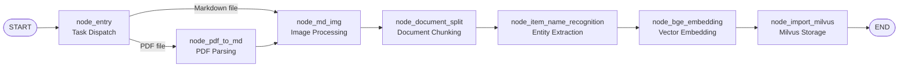
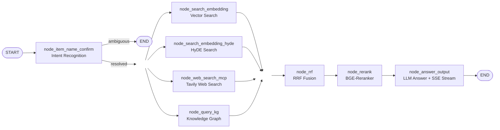

# Enterprise RAG Knowledge Base System

## 1. Project Overview

### 1.1 What is RAG?

Large Language Models (LLMs) tend to hallucinate when facing domain-specific knowledge outside their training data. **Retrieval-Augmented Generation (RAG)** solves this by attaching an external knowledge base to the LLM — retrieving relevant information before generation, grounding the model's answers in real facts.

**RAG Core Definition:** Enhance LLM generation capability by retrieving from an external knowledge base at query time.

**Key roles of LLMs in this RAG system:**
- **Embedding**: Convert text into dense and sparse vectors for similarity-based retrieval
- **Rerank**: Re-score retrieved chunks using a Cross-Encoder model to filter noise and improve precision
- **Generation**: Synthesize the final answer based on retrieved context

**Applicable Scenarios:** Enterprise knowledge base Q&A, intelligent customer service, legal/financial/domain consulting, document assistant, education Q&A, search augmentation

---

### 1.2 Project Introduction

**Enterprise RAG Knowledge Base System** is a production-grade intelligent Q&A system built on Retrieval-Augmented Generation technology. It delivers a full-stack solution combining private knowledge base Q&A, real-time web search augmentation, and multi-dimensional result optimization — enabling private knowledge management, high-precision answers, and flexible business adaptation.

**Total lines of code: ~5,500**

The system consists of two core modules:

1. **Data Ingestion Pipeline**: Supports PDF/Markdown document import with full-chain preprocessing — structured document parsing, intelligent chunking, metadata extraction, and vector storage.

2. **Intelligent Retrieval System**: Integrates hybrid retrieval (dense + sparse vectors), HyDE (Hypothetical Document Embeddings), Tavily web search, and BGE-Reranker for high-accuracy, real-time answers.

---

## 2. Module Design

### 2.1 Data Ingestion Pipeline

#### 2.1.1 Design Goals

Build an efficient data processing pipeline that transforms unstructured documents (PDF, Markdown) into structured, AI-retrievable knowledge units. Key challenges addressed:

1. **Complex document parsing**: Preserve document hierarchy, tables, and image context from PDFs
2. **Semantic integrity**: Attach metadata (product name, section title) to each chunk, turning isolated text into self-contained knowledge units

#### 2.1.2 Processing Pipeline

The pipeline is orchestrated using **LangGraph** state machine. Processing nodes:



**Step 1: Task Dispatch (node_entry)**
- Entry point of the pipeline
- Routes PDF files to the PDF parser; Markdown files directly to image processing

**Step 2: PDF Structured Parsing (node_pdf_to_md)**
- PDFs lack semantic structure — direct text extraction loses layout and context
- Uses **MinerU (Magic-PDF)** to convert PDF into structured Markdown, preserving multi-level headings, tables, and image placeholders

**Step 3: Multimodal Image Processing (node_md_img)**
- Technical documents often contain diagrams with key information
- Uploads images to **MinIO** object storage, generates a persistent URL
- Replaces local image paths in Markdown with MinIO URLs
- Transformation: `` → ``

**Step 4: Intelligent Document Chunking (node_document_split)**
- Long documents must be split to fit LLM context windows
- Hierarchical chunking: paragraph-level first, sentence-level fallback for oversized paragraphs
- Each chunk is prefixed with its full title path (e.g., `[Manual > Troubleshooting > Power Issue]`) to preserve context

**Step 5: Entity Name Recognition (node_item_name_recognition)**
- Chunks often omit the subject (e.g., "Weight is 200g" — weight of what?)
- Extracts the document's primary subject (Item Name, e.g., "Cisco Meraki MS120-8") using LLM
- Attaches Item Name as global metadata to all chunks from that document

**Step 6: Hybrid Vector Embedding (node_bge_embedding)**
- Uses **BGE-M3** model to encode `item_name + content`
- Generates both:
  - **Dense Vector**: semantic/fuzzy matching
  - **Sparse Vector**: keyword/exact matching
- Enables hybrid retrieval combining both vector types

**Step 7: Data Persistence (node_import_milvus)**
- Writes structured data into **Milvus** vector database
- Schema design:
  - `chunk_id` (Int64): unique identifier
  - `content` (String): chunk text
  - `title` (String): full title path
  - `file_title` (String): source file name
  - `item_name` (String): entity/product name
  - `dense_vector` (Float Vector): semantic vector
  - `sparse_vector` (Sparse Float Vector): keyword vector
  - `parent_title`, `part`: hierarchical metadata

#### 2.1.3 Core Tech Stack

| Component | Role |
|-----------|------|
| LangGraph | Pipeline orchestration and state management |
| MinerU | High-accuracy PDF parsing |
| BGE-M3 | Multilingual hybrid embedding model |
| Milvus | High-performance vector database |
| MinIO | Image/file object storage |
| OpenAI GPT-4o-mini | Entity extraction and image understanding |

#### 2.1.4 Vector Database Design

**Document-level index (kb_item_names)**
Stores per-document metadata: `file_title`, `item_name`, and the item name's dense/sparse vectors. Used for fast entity-level pre-filtering before chunk retrieval.

**Chunk-level index (kb_chunks)**
Stores individual text chunks with full metadata. Primary chunking is paragraph-based; oversized paragraphs are split further. All chunks stored with hybrid vectors for retrieval.

---

### 2.2 Intelligent Retrieval Pipeline

#### 2.2.1 Design Goals

Build a high-precision, low-latency Q&A retrieval pipeline that converts natural language questions into accurate answers. Key challenges:

1. **Intent understanding**: Users ask vague questions (e.g., "how much does it cost?") — intent must be clarified before retrieval
2. **Recall vs. precision balance**: Single-path retrieval has blind spots — multi-path retrieval ensures coverage
3. **Hallucination suppression**: Reranking removes irrelevant documents before LLM generation

#### 2.2.2 Processing Pipeline

Orchestrated with **LangGraph** following the flow:



**Step 1: Intent Recognition & Query Rewriting**
- User questions are often colloquial and ambiguous
- LLM analyzes conversation history, extracts/completes key entities (Item Name)
- Rewrites the question into a retrieval-optimized declarative form

**Step 2: Multi-path Retrieval (parallel)**

Three retrieval strategies run concurrently:

- **Vector Search**: BGE-M3 computes semantic similarity, retrieves matching chunks from Milvus using both dense and sparse vectors
- **HyDE (Hypothetical Document Embeddings)**: LLM generates a hypothetical answer to the question, vectorizes it, then searches Milvus — improves recall for implicit intent since the hypothetical answer is semantically closer to real documents than the raw question
- **Web Search (Tavily)**: Fetches real-time external information to supplement the private knowledge base

**Step 3: Result Fusion & Coarse Ranking (RRF)**
- Multi-path results use incompatible scoring scales
- **Reciprocal Rank Fusion (RRF)** merges results purely by rank position — rank-weighted scoring, deduplication, Top-N selection
- Produces a unified candidate list regardless of original score type

**Step 4: Precision Reranking (BGE-Reranker)**
- Coarse retrieval intentionally over-retrieves (high recall, lower precision)
- Cross-Encoder model (BGE-Reranker) performs deep semantic scoring on each `(question, document)` pair
- Retains only Top-K most relevant chunks (e.g., Top 5) before LLM generation

**Step 5: Answer Generation**
- Top-K chunks injected as context into a carefully designed prompt template
- **GPT-4o-mini** synthesizes the final answer
- **SSE (Server-Sent Events)** streams the response token-by-token to the frontend for real-time display

#### 2.2.3 Core Tech Stack

| Component | Role |
|-----------|------|
| LangGraph | RAG pipeline orchestration |
| Milvus | Vector retrieval for document chunks |
| BGE-M3 | Hybrid embedding (dense + sparse) |
| BGE-Reranker | Cross-encoder reranking model |
| OpenAI GPT-4o-mini | Intent understanding, HyDE generation, answer synthesis |
| Tavily | Real-time web search API |
| MongoDB | Session and conversation history storage |
| SSE (Server-Sent Events) | Real-time streaming output to frontend |

---

## 3. Why This Architecture Improves Accuracy

The RAG accuracy problem is decomposed into six engineering layers:

```
Document Structuring → Semantic Chunking → Multi-path Retrieval → Hybrid Search → HyDE Enhancement → Rerank Decision
```

Each layer addresses a specific failure mode:

| Layer | Problem Solved |
|-------|----------------|
| MinerU PDF parsing | Prevents layout collapse and context loss |
| Semantic chunking with title paths | Prevents evidence fragmentation |
| Entity name extraction | Resolves ambiguous subject references |
| Hybrid dense + sparse vectors | Covers both semantic and keyword gaps |
| HyDE retrieval | Bridges query-document semantic space gap |
| RRF fusion | Normalizes incompatible scores across retrieval paths |
| BGE-Reranker | Removes noise before LLM, reduces hallucination |

---

## 4. Setup & Running

### Prerequisites
- Python 3.11+
- Docker (for Milvus, MinIO, MongoDB, Neo4j)
- OpenAI API key
- Tavily API key

### 1. Start Infrastructure Services

Run the required backing services via Docker before starting the app servers.

**Milvus** (vector database):
```bash
docker run -d --name milvus-standalone \
  -p 19530:19530 -p 9091:9091 \
  -v $(pwd)/volumes/milvus:/var/lib/milvus \
  milvusdb/milvus:latest standalone
```

**MinIO** (object storage):
```bash
docker run -d --name minio \
  -p 9000:9000 -p 9001:9001 \
  -e MINIO_ROOT_USER=minioadmin \
  -e MINIO_ROOT_PASSWORD=minioadmin \
  -v $(pwd)/volumes/minio:/data \
  minio/minio server /data --console-address ":9001"
```

**MongoDB** (session history):
```bash
docker run -d --name mongodb \
  -p 27017:27017 \
  mongo:latest
```

**Neo4j** (knowledge graph):
```bash
docker run -d --name neo4j \
  -p 7474:7474 -p 7687:7687 \
  -e NEO4J_AUTH=none \
  neo4j:latest
```

### 2. Download ML Models

```bash
uv run python app/tool/download_bgem3.py
uv run python app/tool/download_reranker.py
```

Update `BGE_M3_PATH` and `BGE_RERANKER_LARGE` in `.env` to point to the downloaded model directories.

### 3. Configure Environment

Create a `.env` file in the project root:

```bash
# MinerU - PDF Parsing
MINERU_MODEL_SOURCE=modelscope
MODELSCOPE_OFFLINE=1
MODELSCOPE_CACHE=your_path
HF_HOME=your_path
MD_ROOT_DIR=./temp-files/
MINERU_API_TOKEN=your_token
MINERU_BASE_URL=https://mineru.net/api/v4

# OpenAI
LLM_DEFAULT_MODEL=gpt-4o-mini
VL_MODEL=gpt-4o-mini
OPENAI_API_KEY=your_openai_key
OPENAI_BASE_URL=https://api.openai.com/v1
LLM_DEFAULT_TEMPERATURE=0.1

# BGE-M3 Embedding Model (downloaded locally from ModelScope)
BGE_M3_PATH=your_path
BGE_M3=BAAI/bge-m3
BGE_DEVICE=cpu
BGE_FP16=0

# BGE Reranker Model
BGE_RERANKER_LARGE=your_path/BAAI/bge-reranker-large
BGE_RERANKER_DEVICE=cpu
BGE_RERANKER_FP16=0

# Milvus Vector Database
MILVUS_URL=http://localhost:19530
CHUNKS_COLLECTION=kb_chunks
ITEM_NAME_COLLECTION=kb_item_names
EMBEDDING_DIM=1024

# MongoDB
MONGO_URL=mongodb://127.0.0.1:27017
MONGO_DB_NAME=kb002

# MinIO Object Storage
MINIO_ENDPOINT=127.0.0.1:9000
MINIO_ACCESS_KEY=minioadmin
MINIO_SECRET_KEY=minioadmin
MINIO_BUCKET_NAME=knowledge-base-files
MINIO_IMG_DIR=/upload-images
MINIO_SECURE=False

# Tavily Web Search
TAVILY_API_KEY=your_tavily_key

# Logging
LOG_CONSOLE_ENABLE=True
LOG_CONSOLE_LEVEL=INFO
LOG_FILE_ENABLE=True
LOG_FILE_LEVEL=ERROR
LOG_FILE_RETENTION=7 days
```

### 4. Install Dependencies
```bash
# Using uv (recommended)
uv sync

# Or using pip
pip install -e .
```

### 5. Run

**Start the File Import Server** (Knowledge Base ingestion UI):
```bash
uvicorn app.import_process.api.file_import_server:app --host 127.0.0.1 --port 8000
# Open in browser: http://127.0.0.1:8000/import
```

**Start the Query Server** (Chat UI):
```bash
uvicorn app.query_process.api.query_server:app --host 127.0.0.1 --port 8001
# Open in browser: http://127.0.0.1:8001/chat
```

---

## 5. Project Structure

```
├── app/
│   ├── clients/          # External service clients
│   ├── conf/             # Configuration files
│   ├── core/             # Logger and core utilities
│   ├── import_process/   # Data ingestion pipeline nodes
│   ├── lm/               # LLM and embedding model wrappers
│   ├── query_process/    # Retrieval pipeline nodes
│   ├── tool/             # Model download utilities (BGE-M3, Reranker)
│   └── utils/            # Helper utilities
│       ├── escape_milvus_string_utils.py
│       ├── format_utils.py
│       ├── normalize_sparse_vector.py
│       ├── path_util.py
│       ├── rate_limit_utils.py
│       ├── sse_utils.py
│       └── task_utils.py
├── docs/             # Documentation
├── logs/             # Runtime logs
├── output/           # Output files
├── prompts/          # Prompt templates
├── volumes/minio/    # MinIO local storage volume
├── .env              # Environment variables (not committed)
├── pyproject.toml
└── uv.lock
```